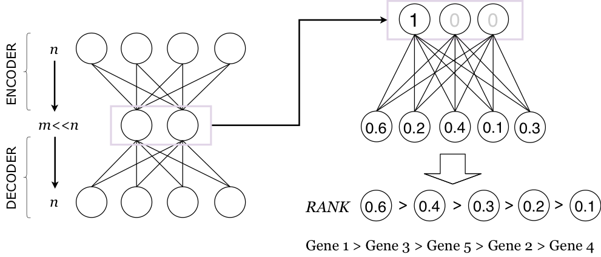

## Using deep auto-encoders for gene clustering in cancer research
 

This repository contains the source codes related to the experiments of my master thesis work at Politecnico di Milano.
### Motivation:
In recent years, cancer research using gene expression data has become more relevant. Several computational approaches have been focused on the problem of cancer classification using data mining methods.  In particular, gene clustering is used to discover previously unknown mechanisms, contributing to a wide range of applications such as drug discovery, cancer prediction, and diagnosis. Identifying new gene clusters remains a critical necessity, as multiple interacting pathways are dysfunctional in cancer. 
We present a novel approach which uses deep neural networks over gene expression data to discover groups of genes involved in common biological functions.
### Methods:
Deep auto-encoders are a class of neural networks [1] used for efficient coding and dimensionality reduction [2]. They are composed of an encoder, transforming a high dimensional space to a lower dimensional one and a decoder, reproducing the original high dimensional input space as output layer. In this work, we use more than 20000 genes and target 400 reduced dimensions. We trained deep auto-encoders on breast cancer and lung cancer data from The Cancer Genome Atlas (TCGA) project. 
The method consists of two pipelines. The first one focuses on tuning the parameters, such as the number of layers and the activation functions, to achieve good reconstruction performances of the network. The output of the middle layer produces a feature reduction, which is tested against well-established feature reduction methods in a classification scenario. The second pipeline is concerned with the extraction of gene modules and the validation of the results. By leveraging the auto-encoder’s network topology, each reduced dimension of the auto-encoder central layer is associated to a cluster of genes. In order to understand the contribution of each gene to each reduced dimension, one-hot vectors (vectors with only one non-zero element) are used as inputs of the decoder and rankings are produced by reading the weights of the outputs (see the Figure below). Clusters are built by selecting into each cluster the genes with the highest weight; clusters are also ranked by their total weight. The effectiveness of these resulting gene clusters then tested, by checking for the over-representation of specific genes in each module with enrichment analysis. 
### Results: 
We observe that the trained networks have the following capabilities: 
1. Solve the binary classification as efficiently as classic feature extraction methods using the reduced dimensions.
2. Enrichments functionally connected to the specific cancer type are found in at least 25% of the top 40 clusters; analysis was performed for Breast Cancer (BRCA) and for Lung Cancer (LUAD and LUSC). Many gene clusters in the top ones were also significantly connected to cancer in general or to other cell activities. Based on information in scientific literature we found:

    * 54% of the top 40 modules contain significant cancer related terms and 25% strictly related to breast cancer activities in the case of the model trained with Breast Cancer.
    * 47% of the top 40 modules contain significant cancer related terms and 29% strictly related to lung cancer activities for the model trained with Lung Cancer.
These results are very interesting because they hint to the fact that it is possible to extract relevant gene interactions about many cancer-related functions with an auto-encoder trained on input reconstruction for a given cancer type. The method is also promising for suggesting the investigation of new gene interactions and pathways.

 

[1]	Baldi, Pierre. Autoencoders, unsupervised learning, and deep architectures, Proceedings of ICML Workshop on Unsupervised and Transfer Learning. 2012.

[2]	Yasi Wang, Hongxun Yao, Sicheng Zhao, Auto-encoder based dimensionality reduction, Neurocomputing, Volume 184: 232-242, 2016.
